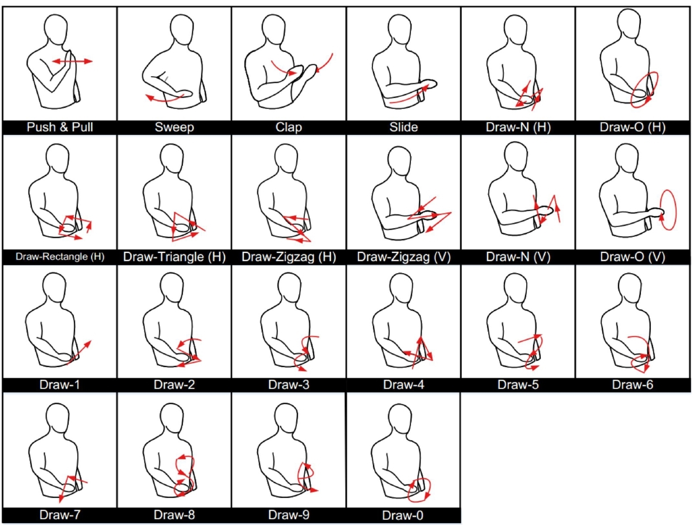

[](https://github.com/Marsrocky/Awesome-WiFi-CSI-Sensing/blob/main/LICENSE)
[](https://github.com/Marsrocky/Awesome-WiFi-CSI-Sensing/graphs/commit-activity)


# SenseFi: A Benchmark for WiFi CSI Sensing
## Introduction
SenseFi is the first open-source benchmark and library for WiFi CSI human sensing, implemented by PyTorch. The state-of-the-art networks, including MLP, CNN, RNN, Transformers, etc, are evaluated on four public datasets across different WiFi CSI platforms. The details are illustrated in our paper [*Deep Learning and Its Applications to WiFi Human Sensing: A Benchmark and A Tutorial*]().

```
(wait for Arxiv)
```

## Requirements

1. Install `pytorch` and `torchvision` (we use `pytorch==1.12.0` and `torchvision==0.13.0`).
2. `pip install -r requirements.txt`

## Run
### Download Processed Data
Please download and organize the [processed datasets](https://drive.google.com/drive/folders/13qxmFQ-h8ei2m7EbBQOCxCHZJ_cDJGFY) in this structure:
```
Benchmark
├── Data
    ├── NTU-Fi_HAR
    │   ├── test_amp
    │   ├── train_amp
    ├── NTU-Fi-HumanID
    │   ├── test_amp
    │   ├── train_amp
    ├── UT_HAR
    │   ├── data
    │   ├── label
    ├── Widardata
    │   ├── test
    │   ├── train
```

### Supervised Learning
To run models with supervised learning (train & test):  
Run: `python run.py --model [model name] --dataset [dataset name]`  

You can choose [model name] from the model list below
- MLP
- LeNet
- ResNet18
- ResNet50
- ResNet101
- RNN
- GRU
- LSTM
- BiLSTM
- CNN+GRU
- ViT

You can choose [dataset name] from the dataset list below
- UT_HAR_data
- NTU-Fi-HumanID
- NTU-Fi_HAR
- Widar

*Example: `python run.py --model ResNet18 --dataset NTU-Fi_HAR`*
### Unsupervised Learning
To run models with unsupervised (self-supervised) learning (train on **NTU-Fi HAR** & test on **NTU-Fi HumanID**):  
Run: `python self_supervised.py --model [model name] ` 

You can choose [model name] from the model list below
- MLP
- LeNet
- ResNet18
- ResNet50
- ResNet101
- RNN
- GRU
- LSTM
- BiLSTM
- CNN+GRU
- ViT

*Example: `python self_supervised.py --model MLP`*  
[*AutoFi: Towards Automatic WiFi Human Sensing via Geometric Self-Supervised Learning*](https://doi.org/10.48550/arXiv.2205.01629)  


## Model
### MLP
- It consists of 3 fully-connected layers followed by activation functions 
### LeNet
- **self.encoder** : It consists of 3 convolutional layers followed by activation functions and Maxpooling layers to learn features
- **self.fc** : It consists of 2 fully-connected layers followed by activation functions for classification
### ResNet
- ***class*** **Bottleneck** : Each bottleneck consists of 3 convolutional layers followed by batch normalization operation and activation functions. And adds resudual connection within the bottleneck
- ***class*** **Block** : Each block consists of 2 convolutional layers followed by batch normalization operation and activation functions. And adds resudual connection within the block
- **self.reshape** : Reshape the input size into the size of 3 x 32 x 32
- **self.fc** : It consists of a fully-connected layer
### RNN
- **self.rnn** : A one-layer RNN structure with a hidden dimension of 64
- **self.fc** : It consists of a fully-connected layer
### GRU
- **self.gru** : A one-layer GRU structure with a hidden dimension of 64
- **self.fc** : It consists of a fully-connected layer
### LSTM
- **self.lstm** : A one-layer LSTM structure with a hidden dimension of 64
- **self.fc** : It consists of a fully-connected layer
### BiLSTM
- **self.lstm** : A one-layer bidirectional LSTM structure with a hidden dimension of 64
- **self.fc** : It consists of a fully-connected layer
### CNN+GRU
- **self.encoder** : It consists of 3 convolutional layers followed by activation functions
- **self.gru** : A one-layer GRU structure with a hidden dimension of 64
- **self.classifier** : It consistis a dropout layer followed by a fully-connected layer and an activation function
 ### ViT
- ***class*** **PatchEmbedding** : Divide the 2D inputs into small pieces of equal size. Then concatenate each piece with cls_token and do positional encoding operation
- ***class*** **ClassificationHead** : It consists of a layer-normalization layer followed by a fully-connected layer
- ***class*** **TransformerEncoderBlock** : It consists of multi-head attention block, residual add block and feed forward block. The structure is shown below:  


## Dataset
#### UT-HAR
[*A Survey on Behavior Recognition Using WiFi Channel State Information*](https://ieeexplore.ieee.org/document/8067693) [[Github]](https://github.com/ermongroup/Wifi_Activity_Recognition)  
- **CSI size** : 1 x 250 x 90
- **number of classes** : 7
- **classes** : lie down, fall, walk, pickup, run, sit down, stand up
- **train number** : 3977
- **test number** : 996  

#### NTU-HAR
[*Efficientfi: Towards Large-Scale Lightweight Wifi Sensing via CSI Compression*](https://ieeexplore.ieee.org/document/9667414)  
- **CSI size** : 3 x 114 x 500
- **number of classes** : 6
- **classes** : box, circle, clean, fall, run, walk
- **train number** : 936
- **test number** : 264  

#### NTU-HumanID
[*CAUTION: A Robust WiFi-based Human Authentication System via Few-shot Open-set Gait Recognition*](https://ieeexplore.ieee.org/abstract/document/9726794)  
- **CSI size** : 3 x 114 x 500
- **number of classes** : 14
- **classes** : gaits of 14 subjects
- **train number** : 546
- **test number** : 294  

*Examples of NTU-Fi data*  


#### Widar
[*Widar3.0: Zero-Effort Cross-Domain Gesture Recognition with Wi-Fi*](https://ieeexplore.ieee.org/document/9516988) [[Project]](http://tns.thss.tsinghua.edu.cn/widar3.0/)  
- **BVP size** : 22 x 20 x 20
- **number of classes** : 22
- **classes** :  
Push&Pull, Sweep, Clap, Slide, Draw-N(H), Draw-O(H),Draw-Rectangle(H),  
Draw-Triangle(H), Draw-Zigzag(H), Draw-Zigzag(V), Draw-N(V), Draw-O(V), Draw-1,  
Draw-2, Draw-3, Draw-4, Draw-5, Draw-6, Draw-7, Draw-8, Draw-9, Draw-10  
- **train number** : 34926
- **test number** : 8726  

*Classes of Widar data*  
  


## Datasets Reference
```
@ARTICLE{8067693,  
author={Yousefi, Siamak and Narui, Hirokazu and Dayal, Sankalp and Ermon, Stefano and Valaee, Shahrokh},  
journal={IEEE Communications Magazine},   title={A Survey on Behavior Recognition Using WiFi Channel State Information},   
year={2017},  
volume={55},  
number={10},  
pages={98-104},  
doi={10.1109/MCOM.2017.1700082}}  

@ARTICLE{9667414,  
author={Yang, Jianfei and Chen, Xinyan and Zou, Han and Wang, Dazhuo and Xu, Qianwen and Xie, Lihua},  
journal={IEEE Internet of Things Journal},   
title={EfficientFi: Towards Large-Scale Lightweight WiFi Sensing via CSI Compression},   
year={2021},  
volume={},  
number={},  
pages={1-1},  
doi={10.1109/JIOT.2021.3139958}}  

@ARTICLE{9726794,  
author={Wang, Dazhuo and Yang, Jianfei and Cui, Wei and Xie, Lihua and Sun, Sumei},  
journal={IEEE Internet of Things Journal},   
title={CAUTION: A Robust WiFi-based Human Authentication System via Few-shot Open-set Gait Recognition},   
year={2022},  
volume={},  
number={},  
pages={1-1},  
doi={10.1109/JIOT.2022.3156099}}  

@ARTICLE{9516988,  
author={Zhang, Yi and Zheng, Yue and Qian, Kun and Zhang, Guidong and Liu, Yunhao and Wu, Chenshu and Yang, Zheng},  
journal={IEEE Transactions on Pattern Analysis and Machine Intelligence},   
title={Widar3.0: Zero-Effort Cross-Domain Gesture Recognition with Wi-Fi},   
year={2021},  
volume={},  
number={},  
pages={1-1},  
doi={10.1109/TPAMI.2021.3105387}}  
```
